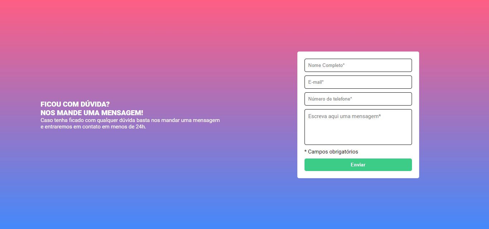
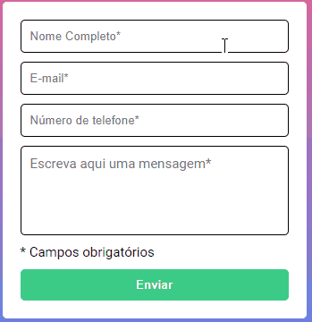
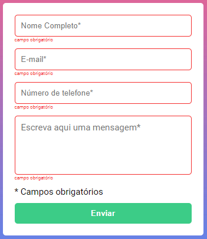
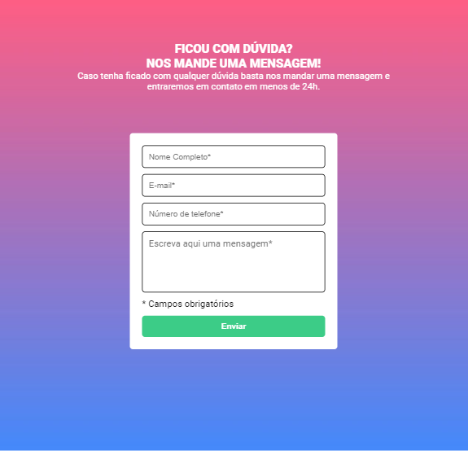
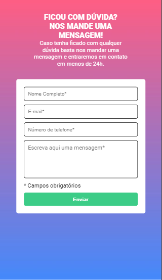

# Quest JavaScript Intermediário
Esse é um formulário, desenvolvido na Quest de JavaScript Intermediário, do curso DevQuest, desenvolvido pelo [Dev em Dobro](https://www.youtube.com/@DevemDobro).

# Tecnologias utilizadas
- HTML;
- CSS; 
- JavaScript.

# Interações com a página
As caixas de texto são preenchíveis e, ao preencher ficam com a cor verde. O botão de enviar é clicável, mas não leva a lugar algum, apenas verifica se falta algum campo ser preenchido. A caixa de "Nome Completo" coloca a primeira letra de cada palavra maiúscula automaticamente.

Caso algum dos campos estiver vazio, o campo vai ficar vermelho e aparecerá uma frase dizendo "campo obrigatório" em baixo do campo não preenchido.

# Responsividade
### Tablet
A página também está responsiva em tablets (768px).

### Mobile
A página também está responsiva em dispositivos mobile (425px).

